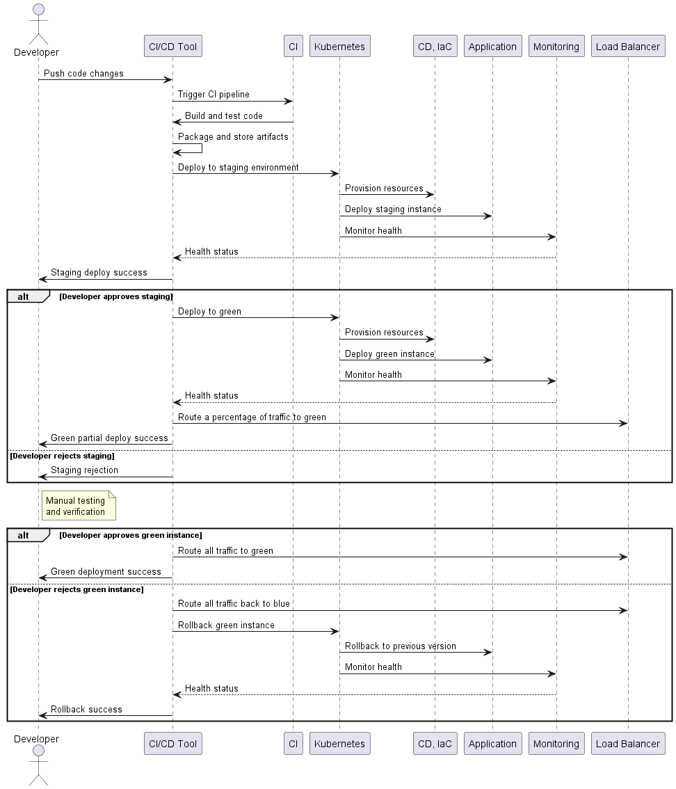

# Proposed Draft: CI/CD Process for Scalable, Multi-Tenant Application

## Overview
This document outlines a high-level Continuous Integration/Continuous Deployment (CI/CD) process for a scalable, multi-tenant application. The process includes considerations for operational health monitoring, blue/green deployments, and tenant isolation. This ensures that code changes are tested thoroughly, deployed reliably, and monitored effectively while maintaining data security, application performance and scalability, and operational stability.

## Considerations Given
- Solution must be scalable and meet the needs of an enterprise product.
- Operational health monitoring should be included.
- Deployments should use blue/green strategy to minimize downtime and mitigate risks.
- The application is multi-tenant and this process should include tenant isolation for security and performance.

## Process Steps
(See diagram below for a visual guide to these steps)
### Source Code Management
Developers commit code to a version control system like Git. Branching strategy and/or tags can be used to isolate versions of software to build and deploy from.

### Continuous Integration (CI)
- Code push automatically triggers CI pipeline.
- CI pipeline runs automated tests (unit, integration, and possibly end-to-end).
- Code quality checks (linting, code formatting) should be performed here.
- If all checks pass, artifacts are packaged and stored.

### Continuous Deployment (CD)
- Upon successful CI pipeline, the CD pipeline is triggered.
- Suggest using Kubernetes or similar for deployment orchestration.
- Infrastructure as Code (IaC) provisions necessary resources (containers, VMs, etc.).

### Blue/Green Deployment Strategy
- Application is deployed to staging environment first.
- If health checks pass, developers test in staging to verify.
- Developers approve staging environment if tests pass.
- A portion of traffic is routed to green for testing.
- Manual testing and verification happens here to ensure the green environment is up and running and ready for full traffic.
- On successful testing, all traffic is routed to green.
- On a failure, all traffic is routed back to blue and green is rolled back.
- Once the green environment is all deployed and finished, blue may either be updated to match green and used for a backup environment, or it can be destroyed and recreated next deployment.
- Traffic routing ensures a seamless transition between blue and green environments, removing the need for server warmup time, etc.
- Rollback mechanism is in place in case of deployment or application failures.

### Software Versions and Tenants
- An assumption is made that all tenants are running the same version of the application.
- If different clients require different versions, additional structure would need to be created around git branches/tags, environment configuration, tenant configuration, deployment configuration, feature toggles, etc.

### Operational Health Monitoring
- Implement monitoring tools (e.g., Prometheus, Grafana) to track performance, resource utilization, and application health.
- Set up alerts and notifications for critical thresholds.
- Log aggregation and analysis (e.g., ELK stack) for troubleshooting and debugging.

### Tenant Isolation
- Application architecture is ideally structured around multi-tenancy. (e.g., Use a microservices architecture so that each service can be deployed and scoped to a single tenant or a group of tenants if needed.)
- Utilize containerization and Kubernetes namespaces for resource isolation.
- Implement Role-Based Access Control (RBAC) and other Kubernetes configurations for further isolation.

### Continuous Feedback
- Collect feedback from monitoring systems, user reports, and customer support.
- Use feedback to iterate and improve the application.

## Process Diagram
This diagram outlines the strategy outlined above in a sequence diagram.

